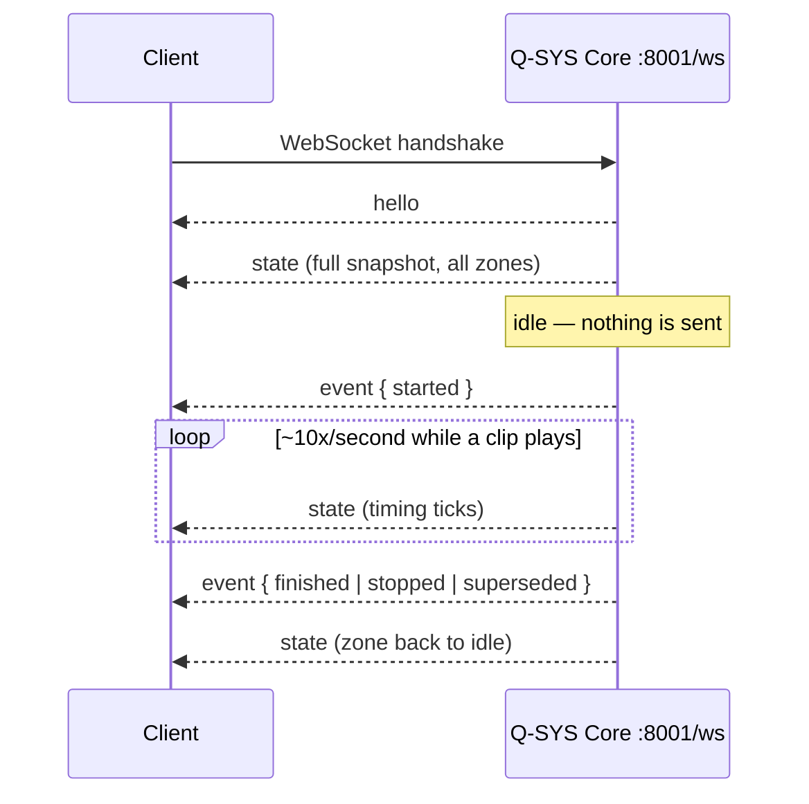

# Q-SYS Audio WebSocket

Wire protocol reference for the live push feed of the Q-SYS **Pre/Post Race audio player**. Read this if you are building a client that consumes the feed (scoreboard, pit display, kiosk). Clients on the Core's LAN connect to the Core directly; remote clients get the same feed relayed through Pandora's own WebSocket endpoint — see [Connecting through Pandora](#connecting-through-pandora).

> Copied verbatim from Pandora's docs (owner, 2026-08-14; relay revision same
> day). Our consumers: the pit station's tablet binds to the **Pandora relay**
> by default (`apps/web/app/admin/[token]/pit/PitClient.tsx`, URL built in
> `apps/web/src/features/signage/pit/qsys.server.ts`; `PIT_QSYS_SOCKET_URL`
> overrides for a LAN direct-to-Core connection), and the server-side play
> press goes through Pandora's HTTP proxy (`qsys.server.ts`). FastTrax's
> `{locationID}` is the Square location `LAB52GY480CJF`.

## The device

Each Q-SYS Core runs a Control Script that plays race audio on the track zones. It exposes an HTTP API and this WebSocket feed on **port 8001**. (Port 8000 on the same Core is the separate GoKart TTS announcer — unrelated protocol.)

| Concept          | Values                                                                                                     |
| ---------------- | ---------------------------------------------------------------------------------------------------------- |
| Zones            | `red` = Red Track, `blue` = Blue Track, `mega` = both pits together. `*` addresses every zone in requests. |
| Configured clips | `pre` = pre-race message, `post` = post-race message, `big` = big race                                     |

## Connecting

```
ws://<core-address>:8001/ws
```

- Plain WebSocket, no authentication, LAN only. Same address and port as the HTTP API.
- The feed is **one-way**: the server pushes, the client never needs to send anything. There is no subscribe step.
- One connection covers the whole device — every zone.

## Message flow



On connect the server sends a `hello` frame, then immediately a full `state` frame. After that:

- A fresh `state` frame arrives whenever anything changes — roughly **10×/second while a clip is playing** (the timing block ticks), **silent while idle**. A quiet socket is normal, not a dead one.
- Discrete `event` frames mark clip lifecycle moments, interleaved with the state pushes.

## Frames

Every frame is a JSON text message with a `type` field. Ignore frame types and fields you don't recognize — the script may add more.

### `hello`

Sent once on connect. Carries nothing the state pushes don't — safe to ignore.

### `state`

The complete current state of every zone. Each push **replaces** the previous one entirely — no diffing needed.

```json
{
  "type": "state",
  "zones": [
    {
      "zone": "red",
      "label": "Red Track",
      "wired": true,
      "playing": true,
      "state": "playing",
      "file": "Pre Race.mp3",
      "lastSource": "clip:pre",
      "timing": {
        "source": "player",
        "remaining": 12.4,
        "remainingText": "0:12",
        "elapsed": 17.6,
        "elapsedText": "0:18",
        "duration": 30.0,
        "durationText": "0:30",
        "progress": 0.59
      }
    }
  ]
}
```

Zone object — the same shape the HTTP `GET /status` endpoint returns:

| Field        | Type    | Meaning                                                                                                |
| ------------ | ------- | ------------------------------------------------------------------------------------------------------ |
| `zone`       | string  | Zone id (`red`, `blue`, `mega`)                                                                        |
| `label`      | string  | Human-readable zone name — display only                                                                |
| `wired`      | boolean | Whether the zone has an audio output wired in the Q-SYS design. Play requests to an unwired zone fail. |
| `playing`    | boolean | Whether audio is currently playing. **Drive logic off this**, not off `state`.                         |
| `state`      | string  | Playback state as a display string                                                                     |
| `file`       | string  | Media library file currently (or last) playing                                                         |
| `lastSource` | string  | Origin of the most recent play request — display only                                                  |
| `timing`     | object  | Live timing block, below                                                                               |

Timing object:

| Field           | Type             | Meaning                                                                                                                          |
| --------------- | ---------------- | -------------------------------------------------------------------------------------------------------------------------------- |
| `source`        | string           | `player` = read off the Audio File Player, `estimated` = counted down from configured clip lengths, `none` = no timing available |
| `remaining`     | number, optional | Seconds left, when known                                                                                                         |
| `remainingText` | string           | Human-readable countdown                                                                                                         |
| `elapsed`       | number, optional | Seconds played, when known                                                                                                       |
| `elapsedText`   | string           | Human-readable elapsed time                                                                                                      |
| `duration`      | number, optional | Clip length in seconds, when known                                                                                               |
| `durationText`  | string           | Human-readable clip length                                                                                                       |
| `progress`      | number, optional | Playback progress, present when duration is known                                                                                |

### `event`

```json
{
  "type": "event",
  "event": "finished",
  "zone": "red",
  "clip": "pre",
  "file": "Pre Race.mp3"
}
```

| Field    | Type             | Meaning                                                                   |
| -------- | ---------------- | ------------------------------------------------------------------------- |
| `event`  | string           | One of the lifecycle names below                                          |
| `zone`   | string, optional | Zone the event happened on                                                |
| `clip`   | string, optional | Configured clip name (`pre`/`post`/`big`), when playback came from a clip |
| `file`   | string, optional | Media library file name                                                   |
| `source` | string, optional | Origin of the play request                                                |

Lifecycle names:

| Event        | Meaning                                                   |
| ------------ | --------------------------------------------------------- |
| `started`    | Playback began on the zone                                |
| `finished`   | The clip played to its end                                |
| `stopped`    | Playback was stopped by a `/stop` request                 |
| `superseded` | A new play request replaced the running clip on that zone |

## Client guidance

- **Reconnect forever with exponential backoff.** Pandora's client starts at 1 s and doubles to a 60 s cap.
- **Nothing to request on reconnect** — the full state arrives right after the handshake.
- **Don't infer disconnection from silence.** The feed is silent while every zone is idle.
- **Treat display strings as display strings.** `state`, `label`, `lastSource`, and the `*Text` fields are for humans; drive behavior off `playing`, `wired`, and the numeric timing fields.

## Connecting through Pandora

If the client can't reach the Core's LAN, Pandora relays this same feed:

```
wss://<pandora-host>/v2/qsys/audio/ws/{locationID}
```

- **No authentication** — the feed is read-only telemetry, so the WebSocket endpoint is open. (Pandora's HTTP endpoints still require the bearer token.)
- `{locationID}` is the Square location ID — Pandora resolves the Core address from it, exactly like the HTTP endpoints. An unknown `locationID` rejects the upgrade with HTTP 400; any other path with 404.
- Frames are relayed **verbatim**, so everything above applies unchanged. Three Pandora-specific additions:
  - On connect you receive a synthetic `{ "type": "hello", "source": "pandora", "address": "...", "upstreamConnected": true|false }` followed by a `state` frame from Pandora's cache — you're warm immediately, without waiting on the Core.
  - `{ "type": "upstream", "connected": false }` arrives when Pandora's own link to the Core drops, and `{ "type": "upstream", "connected": true }` when it returns (followed by the Core's relayed hello and fresh state). While the upstream is down, no state frames arrive — treat your last state as stale.
  - Past events are **not replayed** on connect. For event history, use the polling endpoint below.
- Pandora pings every 30 s and drops clients that don't pong. Browsers and every mainstream WebSocket library answer pings automatically — nothing to implement.

### Polling alternative

The same cache is available over plain HTTPS:

```
GET /v2/qsys/audio/live/{locationID}
```

The response adds two things that are **not** part of the wire protocol: `connected` (Pandora's socket state — while `false`, zones are the last state before the drop) and a `receivedAt` timestamp on each event, stamped by Pandora on arrival. Pandora keeps the 25 most recent events, oldest first.

Pandora also proxies the device HTTP API with validation and consistent error mapping: `POST /v2/qsys/audio/play`, `POST /v2/qsys/audio/stop`, `GET /v2/qsys/audio/status/{locationID}`, `GET /v2/qsys/audio/remaining/{locationID}`, `GET /v2/qsys/audio/clips/{locationID}`. See `/api-docs` for schemas.

## The device HTTP API (same listener)

For completeness — the WebSocket feed is read-only; controlling playback happens over HTTP on the same port:

| Endpoint               | Purpose                                                                                                                                                                                                                                                                                                                       |
| ---------------------- | ----------------------------------------------------------------------------------------------------------------------------------------------------------------------------------------------------------------------------------------------------------------------------------------------------------------------------- |
| `POST /play`           | Body `{ zone, clip \| file, callback? }` — exactly one of `clip`/`file`. `zone` is a single zone, an array, or `*`. Zones run independently — playing on one zone never cancels another. Repeats inside the debounce window return per-zone status `debounced`. The reply is held ~0.6 s so it can include the clip duration. |
| `POST /stop`           | Body `{ zone? }` — omit `zone` to stop every zone.                                                                                                                                                                                                                                                                            |
| `GET /status?zone=`    | Zone state + timing (same zone objects as the `state` frame). `zone` accepts a comma list.                                                                                                                                                                                                                                    |
| `GET /remaining?zone=` | Just the countdown per zone: `{ zone, playing, remaining, remainingText, source }`                                                                                                                                                                                                                                            |
| `GET /clips`           | Configured clip → file map per zone: `{ zone, pre, post, big }`                                                                                                                                                                                                                                                               |

If a `callback` URL is given to `/play`, the Core POSTs `{ zone, clip, file, status }` to it when the clip ends, with `status` one of `finished`, `stopped`, or `superseded`.

HTTP errors: `400` = unknown zone/clip or bad file name, `503` = no requested zone is wired.

---

**Source of truth:** the Control Script running on each Q-SYS Core implements this protocol; this page documents it as consumed by Pandora. Pandora's reference client is `src/utils/qsysAudioSocket.utils.ts`; the relay endpoint is `src/utils/qsysAudioWsServer.utils.ts` (both in Pandora's repo). Last verified against the script deployed August 2026. If the Control Script changes, update this page.
